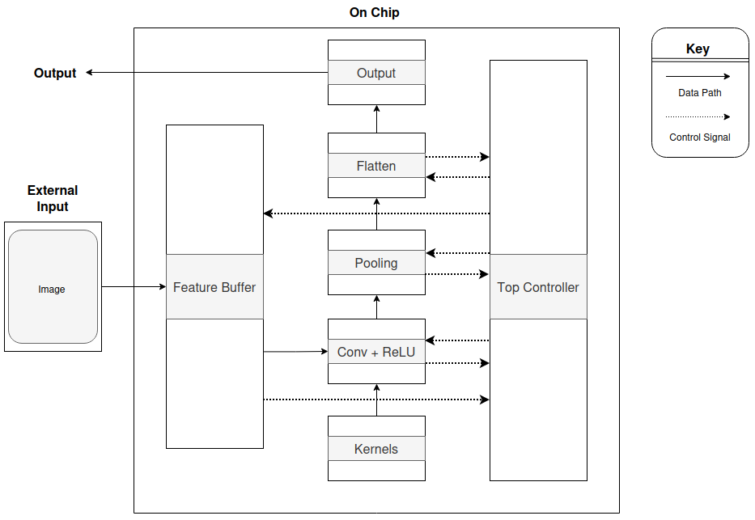
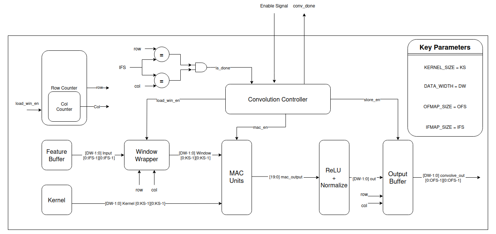
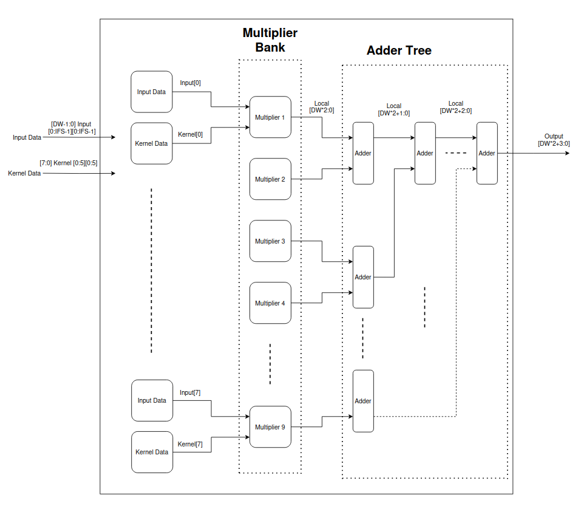
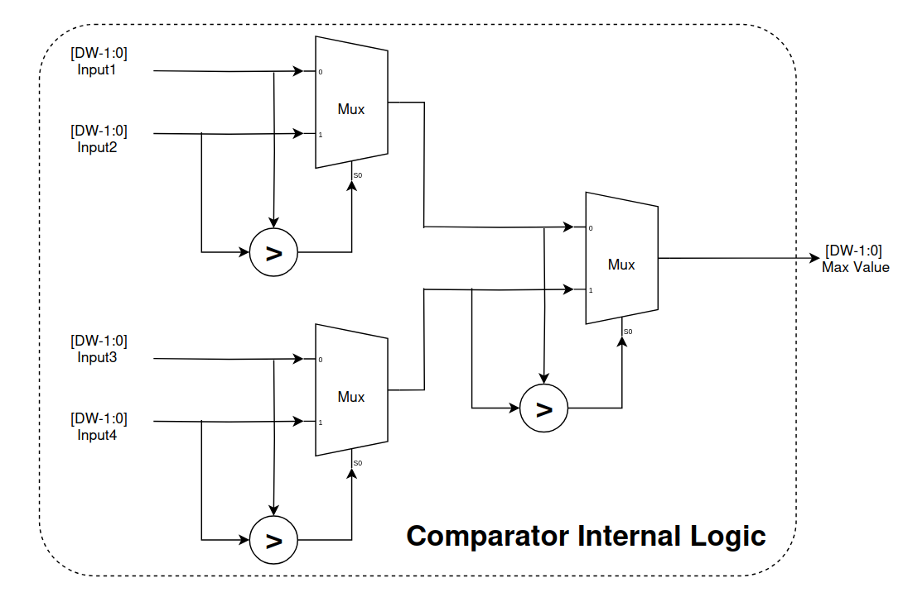

# CNN Hardware Accelerator - SystemVerilog Implementation

**Developed by:** Abdullah Nadeem & Talha Ayyaz  
**Organization:** Maktab-e-Digital Systems Lahore  
**License:** Apache License 2.0  
**Date:** July/August 2025

---

## Table of Contents

- [Why This Project Matters](#why-this-project-matters)
- [What Is a CNN Accelerator?](#what-is-a-cnn-accelerator)
- [Architecture Overview](#architecture-overview)
- [Core Modules](#core-modules)
- [Global Parameters](#global-parameters)
- [Data Flow and Operation](#data-flow-and-operation)
- [Signal Descriptions](#signal-descriptions)
- [Performance Characteristics](#performance-characteristics)
- [Testbench Results](#testbench-results)
- [Usage Guidelines](#usage-guidelines)
- [Requirements](#requirements)
- [Future Enhancements](#future-enhancements)
- [License](#license)
- [Credits](#credits)
- [Contact](#contact)

---
## Abstract

This project presents a complete hardware implementation of a Convolutional Neural Network (CNN) accelerator using SystemVerilog HDL. The design features modular components for convolution, ReLU activation, max pooling, and flattening operations, optimized for FPGA and ASIC deployment. The accelerator achieves significant performance improvements over software implementations. The design supports configurable parameters and includes real-image testbench demonstrations.

---

## How the CNN Accelerator Works

At a high level, the CNN accelerator mimics the structure of a typical convolutional neural network in hardware. It operates on grayscale image inputs and processes them through several dedicated hardware blocks:

1. **Convolution + ReLU Block**:  
   Applies a sliding window 3×3 kernel to the input image, performing multiply-accumulate (MAC) operations to extract features. The result is passed through a ReLU activation function to zero out negative values.

2. **Max Pooling Block**:  
   Reduces the spatial dimensions of the feature maps using 2×2 max pooling, helping to retain essential features while lowering computational load.

3. **Flatten Block**:  
   Converts the pooled 2D matrix into a 1D vector that can be directly fed into a classifier or fully connected layer in later stages.

Each operation is fully pipelined and controlled using finite state machines (FSMs) to ensure efficient and parallel execution. The design is parameterized and reusable, making it suitable for both FPGA prototyping and ASIC flows.

---


## Why This Project Matters

Software-based CNNs are powerful but too slow for edge devices and real-time applications. A **hardware accelerator** dramatically speeds up operations like convolution and pooling, making CNNs viable for:

- Real-time image recognition and classification  
- Object detection in autonomous systems  
- Video processing pipelines  
- Embedded AI systems  
- Edge computing

---

## What Is a CNN Accelerator?

A CNN accelerator is custom hardware optimized to compute CNN operations efficiently using:

- Parallel MAC (multiply-accumulate) units  
- Local memory buffers  
- FSM-driven pipelines  
- ReLU and pooling operations in hardware  

Ideal for fast, low-power inference on embedded platforms.

---

## Architecture Overview

### Top-Level Module: `cnn_accelerator.sv`

Orchestrates the entire CNN pipeline:

**Flow:**  
`Input → Convolution + ReLU → Max Pooling → Flatten → Output`

**Image:**  


>*Figure 1: Top Level Diagram*

---

## Core Modules

### 1. Convolution Module (`conv.sv`)

Applies a 2D convolution and ReLU activation.

**Key Features:**
- Sliding window convolution  
- Zero-padding and stride control  
- ReLU activation built-in  
- FSM-based operation  

**Image:**


> *Figure 2: Convolution Diagram*

---

### 2. MAC Unit (`mac.sv`)

Optimized multiply-accumulate logic for convolution.

**Highlights:**
- Parallel multipliers  
- Adder tree  
- One-cycle accumulation  

**Image:**


> *Figure 3: MAC unit architecture (multipliers + adder tree)*

---

### 3. MaxPooling Module (`maxpool.sv`)

Performs 2×2 max pooling with stride 2.

**Key Features:**
- 2×2 window extractor  
- 3-stage comparator logic  
- FSM-controlled state machine  

**Image:**


> *Figure 4: Maxpool Diagram*

---

### 4. Comparator Unit (`comparator.sv`)

Selects the maximum of a 2×2 input.

**Highlights:**
- Three comparator stages  
- Single-cycle output  
- Unsigned input handling  

**Image:**


> *Figure 5: Comparator logic to extract max from 4 inputs*

---

### 5. Flatten Module (`flatten.sv`)

Converts 2D pooled maps to 1D vectors.

**Features:**
- Row-major flattening  
- Output ready for fully connected layers  

**Image:**


> *Figure 6: Flatten Diagram*

---

## Global Parameters

Defined in `cnn_defs.svh`:

| Parameter | Value | Description |
|----------|--------|-------------|
| `DATA_WIDTH` | 8 | Bit width of input/weights |
| `IFMAP_SIZE` | 128×128 | Input image size |
| `KERNEL_SIZE` | 3×3 | Convolution kernel size |
| `STRIDE` | 1 or 2 | Step size |
| `PADDING` | 1 | Zero-padding |
| `MAC_RESULT_WIDTH` | 19 | MAC accumulator width |

---

## Data Flow and Operation

### Processing Pipeline

1. **Convolution + ReLU:** Extract windows → MAC → ReLU  
2. **Max Pooling:** 2x2 max selection → downsampling  
3. **Flatten:** 2D → 1D vector for classifier input  

**FSM States:**  
- `IDLE` → `PROCESSING` → `DONE`  

---

## Signal Descriptions

### Inputs

| Signal | Width | Description |
|--------|--------|-------------|
| `clk` | 1 | Clock |
| `reset` | 1 | Active-high async reset |
| `en` | 1 | Start signal |
| `cnn_ifmap` | `[DATA_WIDTH-1:0]` | Input image |
| `weights` | `[DATA_WIDTH-1:0]` | Convolution kernel |

### Outputs

| Signal | Width | Description |
|--------|--------|-------------|
| `cnn_ofmap` | `[DATA_WIDTH-1:0]` | Final output |
| `conv_ofmap` | `[DATA_WIDTH-1:0]` | After convolution |
| `pool_ofmap` | `[DATA_WIDTH-1:0]` | After pooling |
| `done` | 1 | Completion flag |

---

## Performance Characteristics

| Operation | Latency | Description |
|-----------|---------|-------------|
| Convolution | CONV_OFMAP² + 2 cycles | Parallel MAC with FSM |
| MaxPooling | POOL_OFMAP² + 2 cycles | 3 comparator stages |
| Throughput | 1 result/cycle | Fully pipelined |
| MAC Latency | Platform dependent | Synthesized for FPGA/ASIC |

---

## Testbench Results

### Input Image
  
*Figure: Original grayscale image, 256×256*

### Convolution Output
  
*Figure: After 3x3 Laplacian convolution and ReLU*

### MaxPooling Output
  
*Figure: After 2x2 max pooling (downsampled to 128×128)*

---

## Usage Guidelines

### Configuration

### Configuring Modules with Parameters

Each module in the CNN accelerator is parameterized to support different image sizes, kernel configurations, and arithmetic precision. You can modify the parameters globally by editing the `cnn_defs.svh` file, or locally during module instantiation.

**Common Parameters:**

| Parameter | Description |
|-----------|-------------|
| `DATA_WIDTH` | Bit width for pixel and weight data (e.g., 8 for 8-bit inputs) |
| `IFMAP_SIZE` | Size of the input feature map (e.g., 128 for 128×128 images) |
| `KERNEL_SIZE` | Size of the convolution kernel (typically 3) |
| `STRIDE` | Step size used in convolution or pooling |
| `PADDING` | Zero-padding around the input feature map |
| `MAC_RESULT_WIDTH` | Bit width of the MAC output accumulator |

**Example: Modifying Parameters in `cnn_defs.svh`**
```systemverilog
parameter int DATA_WIDTH        = 8;
parameter int IFMAP_SIZE        = 256;
parameter int KERNEL_SIZE       = 3;
parameter int STRIDE            = 1;
parameter int PADDING           = 1;
```

Adjusting these parameters will automatically scale the functionality and resource usage of the modules accordingly.


### Run Flow
```systemverilog
enable = 1;
wait (processing_done);
read_output(output_result);
```

---

## Requirements

- **Simulators:** ModelSim, QuestaSim, VCS, Vivado Simulator  
- **Synthesis:** Vivado, Quartus, Design Compiler  
- **Python Tools:** For image loading and testbench data generation

```python
from PIL import Image
import numpy as np

img = Image.open("input.png").convert('L').resize((256, 256))
pixels = np.array(img, dtype=np.uint8)
```

---

## Future Enhancements

- [ ] Multi-kernel/multi-channel support  
- [ ] Bias addition in convolution  
- [ ] Larger or dynamic pooling sizes  
- [ ] Fully connected layers  
- [ ] Quantization (INT4, INT2)  
- [ ] AXI interface & DMA  
- [ ] Power management  

---

## Project Structure

```
cnn_accelerator/
├── rtl/
│   ├── cnn_accelerator.sv
│   ├── conv.sv
│   ├── mac.sv
│   ├── maxpool.sv
│   ├── comparator.sv
│   ├── flatten.sv
│   └── cnn_defs.svh
├── test/
│   ├── cnn_tb.sv
│   └── imgs/
├── docs/
│   └── index.md
│ 
├── scripts/
│   ├── pgmToTxt.sh
│   └── txtToPng.py
│
├── makefile 
```

---

## License

Licensed under the **Apache License 2.0**.  
See [LICENSE](LICENSE) for full terms.

---

## Credits

- **Abdullah Nadeem** — System Architecture & RTL Implementation  
- **Talha Ayyaz** — Verification & Optimization  

---

## Contact

**Maktab-e-Digital Systems Lahore**  
Lahore, Punjab, Pakistan  
*[\[GitHub Repository Link\]](https://github.com/meds-uet/CNN-Accelerator)*

---

*This project is a practical, hardware-level implementation of CNN inference designed for FPGAs.*